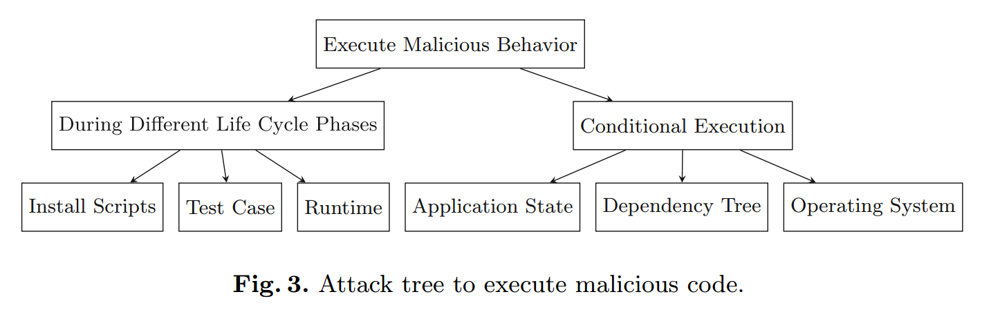

## OSS Supply Chain 攻击分类
### Taxonomy of Attacks on Open-Source Software Supply Chains
Main idea: The focus of the taxonomy is not on what malicious code does, but how attackers place it in upstream projects.

- Develop and Advertise Distinct Malicious Package from Scratch 从头开始开发和宣传独特的恶意软件包
- Create Name Confusion with Legitimate Package 与合法软件包造成名称混淆
- Subvert Legitimate Package 颠覆合法包
  - Inject into Sources of Legitimate Package
  -  Inject During the Build of Legitimate Package
  -  Distribute Malicious Version of Legitimate Package
  -  Dangling references

在对供应链攻击的调查和分类基础上，提出了一些预防方法（safeguards），要求链条中所有的利益相关者都积极参与。

### Backstabber’s Knife Collection: A Review of Open Source Software Supply Chain Attacks
- tamper with the end product
- injecting the malicious code into a dependency

Related discussion: 

## 对 XZ Utils 的攻击
### 严重后果
绕过 SSH 身份验证，服务端可以以 root 权限执行任意命令

### 时间线
- 2021年1月26日，GitHub账号JiaT75创建
- 2021年10月19日，JiaT75向libarchive项目提交第一个PR
  - 在那一年，Jia Tan共提交了546次代码
- 2022年，Jia Tan 通过邮件列表向 XZ 提交了一个补丁
- 一个新的人物 Jigar Kumar 开始施压要求合并这个补丁
- 2022年2月6日，Jia Tan在XZ项目中做出了他的第一次正式提交，这次提交增加了对LZMA和LZMA2编码器的参数验证功能
- 不久之后，Jigar Kumar 开始向 XZ 项目的维护者 Lasse Collin 施压，以心理健康为由，要求增加另一位维护者
- 之后，Lasse Collin 将 JiaT75 设为了新的项目维护者，Jigar Kumar再也没有出现
- 2023年6月27日至28日，Jia Tan对XZ Utils项目进行了一系列关键的更改，从而为后续的攻击做好了准备。
  - 特别是，项目中的一个文件crc64_fast.c，新增了对一种名为ifunc的技术的支持
- 2023年3月份，JiaT75把XZ项目在Google的oss-fuzz工具上注册的主邮箱改为了他个人的Gmail邮箱
  - 这一行为似乎暗示，他们想要第一时间接收到XZ项目中发现的漏洞报告，以此来及时知晓自己的恶意操作被揭露的情况
- 2023年7月8日，JiaT75在oss-fuzz项目中提交了一个请求，该项目负责对XZ等多个开源软件项目进行自动错误检测
  - 这个请求实际上关闭了一种特定的错误检测方式，从而防止oss-fuzz发现XZ项目中潜藏的恶意代码
- 2024年2月15日，JiaT75通过修改XZ项目的配置文件，加入了一个规则来忽略特定的脚本文件 build-to-host.m4
  - 这个脚本就被包含在了项目的正式发布版本中——它会在构建过程中执行，并植入一段负责在受害者电脑上安装后门的恶意代码
- 2024年2月23日，JiaT75在XZ项目的测试文件夹中加入了两个含有隐藏后门的测试文件
- 2024年2月24日，JiaT75在GitHub release中发布第一个包含后门的版本5.6.0
- debian 社区中 Jonathan Nieder 等开发者提出了将问题版本包含在 Debian 中的请求
- 2024年2月27日，这个带有安全隐患的版本被Fedora采纳
- 2024年3月9日，JiaT75更新了后门程序，发布了版本5.6.1，Fedora同样更新了这个版本
- 后门被发现

### 分类
- 根据注入对象
  - 对各类Unix/Linux系统而言，将恶意代码注入依赖项
  - 对XZ而言，直接攻击最终产品
- 根据注入方式
  - 源代码注入和编译构建时注入的结合
- 根据恶意代码的执行
  - 条件执行
    - 只有x86/64下的Linux环境才会触发
    - 命令行参数argv[0]为/usr/sbin/sshd
    - 未设置TERM、LD_DEBUG、LD_PROFILE环境变量
    - 包含LANG环境变量

### 影响分析
危害极大，可以绕过ssh认证，但对真实场景的影响相对有限
1. 发现及时：被Debian unstable分支、Fedora Rawhide、Fedora 40、Arch Linux等少数仓库集成，还没有被大规模应用，CentOS/Redhat/Ubuntu/Debian/Fedora等的stable仓库都不受影响。
2. 条件执行：对于MacOS用户，通过homebrew或直接编译安装可能使用到受影响的组件，但其恶意代码判断了只有x86/64下的Linux环境才会触发，因此不会被执行。
3. 直接编译的openssh没有依赖liblzma，不受影响，而Ubuntu等系统发行版中通过systemd管理的版本通过libsystemd依赖了liblzma，受到影响。

### 攻击原理
- OpenSSH服务器（sshd进程），依赖 liblzma 项
- bad-3-corrupt_lzma2.xz 和 good-large_compressed.lzma：新引入了两个数据文件作为测试用例，实际上作为恶意payload使用
- /m4/build-to-host.m4文件：额外引入了`gl_[$1]_config='sed \"r\n\" $gl_am_configmake | eval $gl_path_map | $gl_[$1]_prefix -d 2>/dev/null'`命令，从而生成恶意的构建代码
- 通过执行make命令，payload得以被执行，生成最终投毒注入代码
- 注入后门的 liblzma 会通过 ifunc 方式, 劫持用于验证RSA签名的 RSA_public_decrypt 函数到其恶意实现 (符号为 Llzma_index_prealloc_0)
- 恶意代码会检查RSA结构中传入的公共模数 N 值，这个模数完全受到攻击者控制。
- 恶意代码使用硬编码的密钥（采用ChaCha20对称加密算法）对 N 值进行解密。
- 解密后的数据通过Ed448椭圆曲线签名算法进行有效性验证。由于这是一种非对称签名算法，后门只包含了公钥，这意味着只有攻击者能够为后门生成有效载荷。
- 攻击者在该函数内验证密钥 
  - 若通过验证, 通过system()函数执行任意命令。
  - 若未通过验证, 则跳到正确的 RSA_public_decrypt 实现, 因此不会影响正常的 ssh 连接。这意味着，除了攻击者外，无法通过网络发现易受攻击的机器。

#### 什么是 ifunc
ifunc是一种在编译时动态解析函数地址的机制，它是GNU C库（glibc）引入的特性。在使用ifunc时，编译器会生成一个特殊的符号，其地址在运行时会被动态地解析为特定的函数。这使得在动态链接库中，可以根据运行时的环境选择不同的函数实现。

<b>不安全的函数替换：</b> 在某些情况下，ifunc 可能被用于替换标准库或系统库中的函数实现。如果替换的函数实现存在漏洞或者恶意被篡改，可能会导致系统受到攻击。
