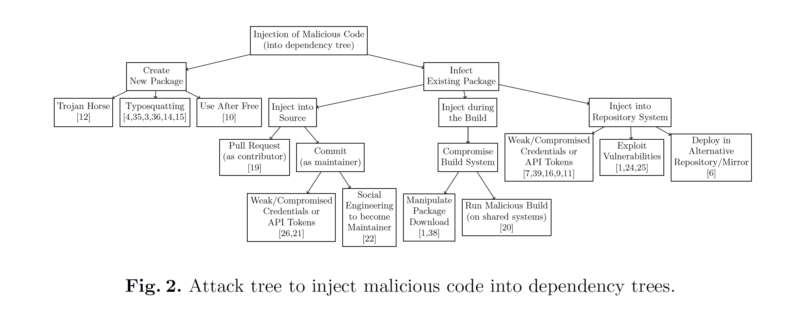

## OSS Supply Chain 攻击分类
### Taxonomy of Attacks on Open-Source Software Supply Chains
Main idea: The focus of the taxonomy is not on what malicious code does, but how attackers place it in upstream projects.

- Develop and Advertise Distinct Malicious Package from Scratch 从头开始开发和宣传独特的恶意软件包
- Create Name Confusion with Legitimate Package 与合法软件包造成名称混淆
- Subvert Legitimate Package 颠覆合法包
  - Inject into Sources of Legitimate Package
  -  Inject During the Build of Legitimate Package
  -  Distribute Malicious Version of Legitimate Package
  -  Dangling references

在对供应链攻击的调查和分类基础上，提出了一些预防方法（safeguards），要求链条中所有的利益相关者都积极参与。

### Backstabber’s Knife Collection: A Review of Open Source Software Supply Chain Attacks
- tamper with the end product
- injecting the malicious code into a dependency

## 对 XZ Utils 的攻击
### 严重后果
绕过 SSH 身份验证，服务端可以以 root 权限执行任意命令

### 时间线
- 2021年1月26日，GitHub账号JiaT75创建
- 2021年10月19日，JiaT75向libarchive项目提交第一个PR
  - 在那一年，Jia Tan共提交了546次代码
- 2022年，Jia Tan 通过邮件列表向 XZ 提交了一个补丁
- 一个新的人物 Jigar Kumar 开始施压要求合并这个补丁
- 2022年2月6日，Jia Tan在XZ项目中做出了他的第一次正式提交，这次提交增加了对LZMA和LZMA2编码器的参数验证功能
- 不久之后，Jigar Kumar 开始向 XZ 项目的维护者 Lasse Collin 施压，以心理健康为由，要求增加另一位维护者
- 之后，Lasse Collin 将 JiaT75 设为了新的项目维护者，Jigar Kumar再也没有出现
- 2023年6月27日至28日，Jia Tan对XZ Utils项目进行了一系列关键的更改，从而为后续的攻击做好了准备。
  - 特别是，项目中的一个文件crc64_fast.c，新增了对一种名为ifunc的技术的支持
- 2023年3月份，JiaT75把XZ项目在Google的oss-fuzz工具上注册的主邮箱改为了他个人的Gmail邮箱
  - 这一行为似乎暗示，他们想要第一时间接收到XZ项目中发现的漏洞报告，以此来及时知晓自己的恶意操作被揭露的情况
- 2023年7月8日，JiaT75在oss-fuzz项目中提交了一个请求，该项目负责对XZ等多个开源软件项目进行自动错误检测
  - 这个请求实际上关闭了一种特定的错误检测方式，从而防止oss-fuzz发现XZ项目中潜藏的恶意代码
- 2024年2月15日，JiaT75通过修改XZ项目的配置文件，加入了一个规则来忽略特定的脚本文件 build-to-host.m4
  - 这个脚本就被包含在了项目的正式发布版本中——它会在构建过程中执行，并植入一段负责在受害者电脑上安装后门的恶意代码
- 2024年2月23日，JiaT75在XZ项目的测试文件夹中加入了两个含有隐藏后门的测试文件
- 2024年2月24日，JiaT75在GitHub release中发布第一个包含后门的版本5.6.0
- debian 社区中 Jonathan Nieder 等开发者提出了将问题版本包含在 Debian 中的请求
- 2024年2月27日，这个带有安全隐患的版本被Fedora采纳
- 2024年3月9日，JiaT75更新了后门程序，发布了版本5.6.1，Fedora同样更新了这个版本
- 后门被发现

### 攻击原理
- 注入后门的 liblzma 会通过 ifunc 方式, 劫持用于 RSA 解密的 RSA_public_decrypt 函数到其 liblzma 内的恶意实现 (符号为 Llzma_index_prealloc_0).
- 攻击者在该函数内验证 payload 中的密钥 (漏洞的设计是:只有攻击者才能利用)
  - 若通过验证, 则通过 system() 执行攻击者的命令
  - 若未通过验证, 则跳到正确的 RSA_public_decrypt 实现, 因此不会影响正常的 ssh 连接